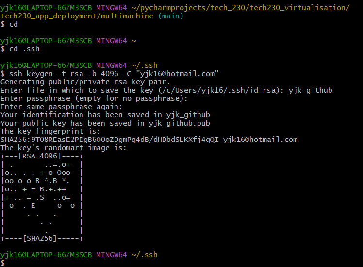
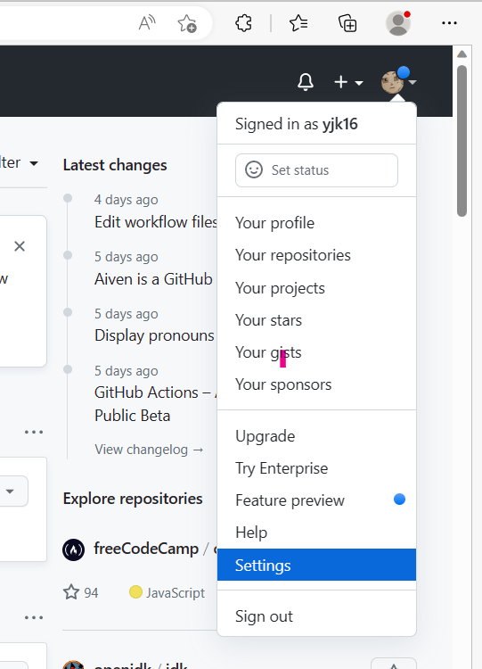

# SSH KEYS ON GITHUB

To use ssh keys on Github...

### First open Bash and cd from Home into .ssh

then:

`ssh-keygen -t rsa -b 4096 -C "yjk16@hotmail.com`
this generates a public/ private rsa key pair.  It will ask you to enter file in which to save the key. Use a good name.

Then it will ask you to enter a passphrase twice.  You can leave this empty.

It should bring up some randomart:

`ls` to check that the files are there.

----

### Go to Github

Click on your profile picture on the top right hand corner and then settings:

Then `SSH and GPG keys` on the left.

Click `new ssh key`

Enter a title...

----

### Back to Bash

`cat <git key>`

In this instance:

`cat yjk_github.pub`

and copy the key that follows (making sure not to copy any whitespace) and paste this into the Github key box.

Add the ssh key.

----

### Back to Bash

Enter:

`ssh -T git@github.com`

You should get:

`Hi yjk16! You've successfully authenticated, but GitHub does not provide shell access.`

Then enter:

`ssh-agent -s`
which opens an agent to manage the keys.

Then enter:

`ssh-add ~/.ssh/<git key>`

In this instance:

`ssh-add ~/.ssh/yjk_github`

It should say:

`Identity added: /c/Users/yjk16/.ssh/yjk_github (yjk16@hotmail.com)`

And enter:

`ssh -T git@github.com`
Should be successfully authenticated.

----

### To Clone a Github repo

1. Make a new repo on github

2. Copy the ssh code

3. In your Bash terminal go to the directory you want to be in

4. Enter:
`git clone <ssh code>

----

After this, it can be used as any other Git repo with the standard commands.